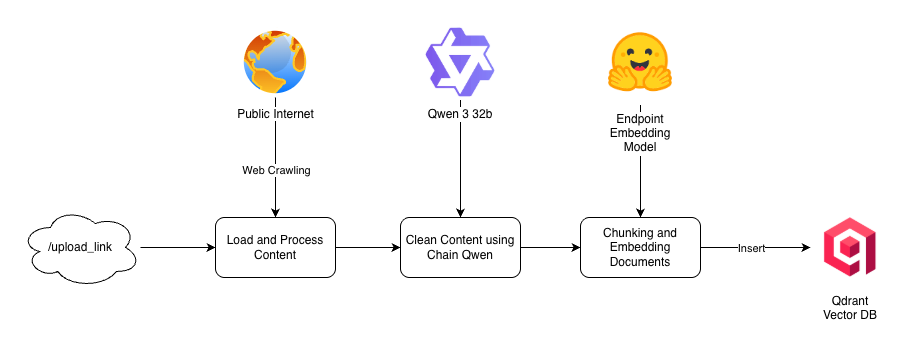

# 🌌 Orion — Knowledge Agent API

Welcome to **Orion**, a FastAPI-based backend for building retrieval-augmented agent experiences. It provides a minimal yet production-minded API for interacting with an LLM-powered assistant that can answer domain-specific questions by grounding its responses in a curated knowledge base.

### ☁️ Production Deployment

Orion can be deployed to any managed container platform (Cloud Run, ECS, Fly.io, etc.). The reference deployment runs on **Google Cloud Run**. Explore the public Swagger UI at [https://orion-53063754153.asia-southeast2.run.app/docs](https://orion-53063754153.asia-southeast2.run.app/docs) and click **Authorize**, supplying the `TOKEN` configured for that environment to access the protected endpoints.

> ⚠️ **Note:** The first access might take a little longer to respond because Cloud Run’s *request-balanced* system automatically **scales down to zero** when idle and **warms up again** upon new requests.

### 🔄 Development-to-Production Flow

<p align="center">
  
</p>

1. **Development Process** — Features are planned, implemented, and reviewed locally before opening a pull request.
2. **Push / Merge to GitHub** — Once approved, the merge triggers the CI pipeline on the hosted repository.
3. **CI: Test · Build · Push** — Automated checks run, the Docker image is built, and the artifact is pushed to Docker Hub.
4. **Docker Hub Registry** — Serves as the immutable source for runtime images consumed in production.
5. **Cloud Run Deployment** — The latest image is pulled and rolled out on Google Cloud Run, wired to the public API endpoint.
6. **Secret Manager** — Managed secrets (TOKEN, database keys, Langfuse keys, etc.) are injected as environment variables during deployment.

---

## 🧠 Reference Architecture

<p align="center">
  
</p>

### Component Responsibilities

| Component | Role in the Agent |
|-----------|-------------------|
| **Clients** | Web apps, internal tools, or integrations send authenticated questions to Orion. |
| **Orion Service** | FastAPI handles HTTP, validates bearer tokens, and forwards work to the LangChain/LangGraph agent that chooses between retrieval, memory, and generation tools. |
| **Embedding Service** | Produces dense vectors for new documents during ingestion. Any Hugging Face or self-hosted embedding model can be used. |
| **Vector Database** | Stores embeddings and supports semantic search to supply the agent with grounded knowledge. Qdrant is used in the reference deployment but can be swapped. |
| **Conversation Store** | Maintains per-user conversation state so follow-up questions inherit prior context. MongoDB is the default implementation. |
| **Observability Stack** | Tracks prompts, traces, and evaluation metrics for debugging and governance (Langfuse in the reference setup). |
| **LLM Runtime** | Executes the chat model that drafts the natural-language answer. The project ships with Groq-hosted Qwen 3 32B but any OpenAI-compatible endpoint works. |

### 🧩 Knowledge Ingestion Flow

<p align="center">
  
</p>

1. **Client Upload Trigger** — A client sends a request to the `/upload-link` endpoint to register a new knowledge source.
2. **Web Crawling / Ingestion** — Orion fetches the referenced webpage (or document), capturing its contents as raw text.
3. **LLM Cleaning** — The raw text is normalized by the configured LLM so the content is structured and easy to chunk.
4. **Chunking** — The polished text is segmented into retrieval-friendly chunks.
5. **Vector Store Insertion** — Each chunk is embedded and persisted into the vector database to make it searchable for the agent.

---

## 🚀 Quickstart

### 1. Clone & Install (Conda)
```bash
git clone <this-repo-url>
cd orion
conda create -n orion python=3.11 -y
conda activate orion
# optional helper if you prefer scripted setup
bash scripts/init.sh
pip install -e .
```

### 2. Configure Environment
Create a `.env` file (or export variables) with the required secrets for your environment:

```env
MONGODB_URI=<mongodb-uri>
GROQ_API_KEY=<groq-api-key>
QDRANT_API_KEY=<qdrant-api-key>
HF_TOKEN=<hf-inference-token>
LANGFUSE_SECRET_KEY=<langfuse-secret-key>
LANGFUSE_PUBLIC_KEY=<langfuse-public-key>
LANGFUSE_HOST="https://cloud.langfuse.com"
TOKEN=<api-token>
```

### 3. Run the API
```bash
uvicorn orion.main:app --reload --port 8000
```
Open http://localhost:8000/docs to explore the interactive Swagger UI.

> ℹ️ **Knowledge Source via MCP**
>
> Orion retrieves its knowledge from a Qdrant vector store that is exposed through the [Moon MCP project](https://github.com/aditya624/moon). To run Orion locally, make sure you clone, install, and run the MCP service so the agent can fetch documents from Qdrant.

### 4. (Optional) Docker Run
```bash
docker pull aditya624/orion:latest
docker run --env-file .env -p 8000:8000 aditya624/orion:latest
```

---

## 🔐 Authentication
All endpoints use HTTP Bearer authentication. Clients must send:

```
Authorization: Bearer <TOKEN>
```

Requests without a matching token receive `401 Unauthorized` responses.

---

## 📚 API Reference

### Agent Service (`/v1/agent`)
| Method | Path | Description |
|--------|------|-------------|
| `GET`  | `/health` | Liveness probe for the agent service. |
| `POST` | `/generate` | Main entrypoint for agent Q&A. Returns the answer and latency (ms). |
| `GET`  | `/history` | Fetches conversation history for a `user_id` + `session_id` pair, ordered ascending or descending. |

#### Generate Request Example
```bash
TOKEN="<your-api-token>"
# Replace http://localhost:8000 with https://orion-53063754153.asia-southeast2.run.app if you want to call the public Cloud Run deployment.
curl -X POST http://localhost:8000/v1/agent/generate \
  -H "Authorization: Bearer $TOKEN" \
  -H "Content-Type: application/json" \
  -d '{
        "input": "What are the key offerings covered in the knowledge base?",
        "session_id": "demo-session",
        "user_id": "demo-user"
      }'
```

**Request fields**

| Field | Type | Description |
|-------|------|-------------|
| `input` | `string` | Natural-language question that the agent should answer. |
| `session_id` | `string` | Conversation identifier so follow-up questions reuse previous context. |
| `user_id` | `string` | Unique identifier for the caller; partitions history storage per user. |

#### Generate Response Example
```json
{
  "answer": "Hello! Here's a quick overview of the knowledge captured in the Orion demo workspace:\n\n1. **Product Offering**  \n   - Overview of flagship services, including survey tooling and managed research engagements.\n   - Audience segmentation and typical use-cases.\n\n2. **Industry Playbooks**  \n   - How teams in FMCG, finance, and technology leverage the platform.\n   - Example KPIs to monitor after rollout.\n\n3. **Operations & Data**  \n   - Available respondent panels, data governance policies, and insight delivery format.\n\n4. **Getting Started Tips**  \n   - Resources to help new analysts craft better prompts.\n   - Links to onboarding documentation.\n\nLet me know if you want a deeper dive into any of these areas!",
  "session_id": "demo-session",
  "latency_ms": 11060
}
```

**Response fields**

| Field | Type | Description |
|-------|------|-------------|
| `answer` | `string` | Model-generated response grounded in the configured knowledge base. |
| `session_id` | `string` | Echoes the conversation identifier supplied in the request. |
| `latency_ms` | `number` | End-to-end processing time in milliseconds for the request. |

#### History Request Example
```bash
TOKEN="<your-api-token>"
# Replace http://localhost:8000 with https://orion-53063754153.asia-southeast2.run.app if you want to call the public Cloud Run deployment.
curl -G http://localhost:8000/v1/agent/history \
  -H "Authorization: Bearer $TOKEN" \
  --data-urlencode "user_id=demo-user" \
  --data-urlencode "session_id=demo-session" \
  --data-urlencode "order=DESC" \
  --data-urlencode "offset=0" \
  --data-urlencode "limit=20"
```

**Query parameters**

| Parameter | Type | Description |
|-----------|------|-------------|
| `user_id` | `string` | Required identifier of the user whose chat history to fetch. |
| `session_id` | `string` | Required conversation thread within the user's history. |
| `order` | `"ASC" \| "DESC"` | Sort direction for the results; defaults to newest first (`DESC`). |
| `offset` | `number` | Number of records to skip for pagination; defaults to `0`. |
| `limit` | `number` | Maximum number of history entries to return; defaults to `20`. |

#### History Response Example

```json
{
  "histories": [
    {
      "user_id": "demo-user",
      "session_id": "demo-session",
      "input": "What knowledge is available in the demo space?",
      "answer": "Hello! Here's a quick overview of the knowledge captured in the Orion demo workspace:\n\n1. **Product Offering**  \n   - Overview of flagship services, including survey tooling and managed research engagements.\n   - Audience segmentation and typical use-cases.\n\n2. **Industry Playbooks**  \n   - How teams in FMCG, finance, and technology leverage the platform.\n   - Example KPIs to monitor after rollout.\n\n3. **Operations & Data**  \n   - Available respondent panels, data governance policies, and insight delivery format.\n\n4. **Getting Started Tips**  \n   - Resources to help new analysts craft better prompts.\n   - Links to onboarding documentation.\n\nLet me know if you want a deeper dive into any of these areas!",
      "created_at": "2025-10-19T09:02:18.446000"
    }
  ]
}
```

**Response fields**

| Field | Type | Description |
|-------|------|-------------|
| `histories` | `object[]` | Array of prior question/answer pairs for the requested user and session. Each entry has the fields below. |

**History entry object**

| Field | Type | Description |
|-------|------|-------------|
| `user_id` | `string` | User identifier associated with the conversation turn. |
| `session_id` | `string` | Session identifier grouping the turn into a chat thread. |
| `input` | `string` | Original user question captured for that turn. |
| `answer` | `string` | Agent response that was returned for the question. |
| `created_at` | `string \| null` | ISO 8601 timestamp when the turn was stored (may be `null` if unavailable). |

### Knowledge Service (`/v1/knowledge`)
| Method | Path | Description |
|--------|------|-------------|
| `GET`  | `/health` | Liveness probe for the knowledge ingestor. |
| `POST` | `/upload-link` | Deduplicates and ingests new web pages. Stores chunks in Qdrant and embeddings on Hugging Face. |

#### Upload Request Example
```bash
TOKEN="<your-api-token>"
# Replace http://localhost:8000 with https://orion-53063754153.asia-southeast2.run.app if you want to call the public Cloud Run deployment.
curl -X POST http://localhost:8000/v1/knowledge/upload-link \
  -H "Authorization: Bearer $TOKEN" \
  -H "Content-Type: application/json" \
  -d '{
        "links": [
          "https://docs.example.com/overview",
          "https://docs.example.com/platform/analytics",
          "https://docs.example.com/platform/automation",
          "https://docs.example.com/resources/getting-started"
        ]
      }'
```

#### Upload Response Example
```json
{
  "skipped": [
    "https://docs.example.com/overview"
  ],
  "processed": [
    "https://docs.example.com/platform/analytics",
    "https://docs.example.com/platform/automation",
    "https://docs.example.com/resources/getting-started"
  ],
  "counts": {
    "skipped": 1,
    "processed": 3,
    "total_input": 4,
    "total_unique": 4
  }
}
```

**Request fields**

| Field | Type | Description |
|-------|------|-------------|
| `links` | `string[]` | Array of absolute URLs to ingest. Duplicates are automatically removed before processing. |

#### Upload Response Example
```json
{
  "skipped": [
    "https://docs.example.com/overview"
  ],
  "processed": [
    "https://docs.example.com/platform/analytics",
    "https://docs.example.com/platform/automation",
    "https://docs.example.com/resources/getting-started"
  ],
  "counts": {
    "skipped": 1,
    "processed": 3,
    "total_input": 4,
    "total_unique": 4
  }
}
```

**Response fields**

| Field | Type | Description |
|-------|------|-------------|
| `skipped` | `string[]` | Links that were already present in Qdrant and therefore not reprocessed. |
| `processed` | `string[]` | Newly ingested links that completed crawling, cleaning, chunking, and embedding. |
| `counts` | `object` | Summary of how many links were skipped or processed. Contains the keys below. |

**`counts` object**

| Field | Type | Description |
|-------|------|-------------|
| `skipped` | `number` | Count of links returned in the top-level `skipped` array. |
| `processed` | `number` | Count of links returned in the top-level `processed` array. |
| `total_input` | `number` | Total number of links received in the original request payload (including duplicates). |
| `total_unique` | `number` | Number of distinct links evaluated after duplicate removal. |

## 🗂️ Project Structure
```
orion/
├── .github/
│   └── workflows/           # CI configuration for linting, testing, and deploys
├── dockerfile               # Container image definition for production deployments
├── docs/
│   └── assets/              # Architecture & process diagrams
├── orion/
│   ├── __init__.py
│   ├── agent/               # LangGraph agent, state, and tool orchestration
│   ├── api/                 # FastAPI routers, dependencies, and auth
│   ├── config.py            # Pydantic settings pulled from the environment
│   ├── main.py              # FastAPI application factory & middleware
│   └── tools/               # Knowledge ingestion/query utilities
├── pyproject.toml           # Poetry/PEP 621 metadata, dependencies, and tooling config
├── scripts/                 # Helper scripts (e.g., init.sh for local setup)
├── tests/                   # Pytest-based API & ingestion tests
└── README.md                # You are here ✨
```

---

## 🤝 Contributing
Issues and pull requests are welcome!

Happy building! 💫
